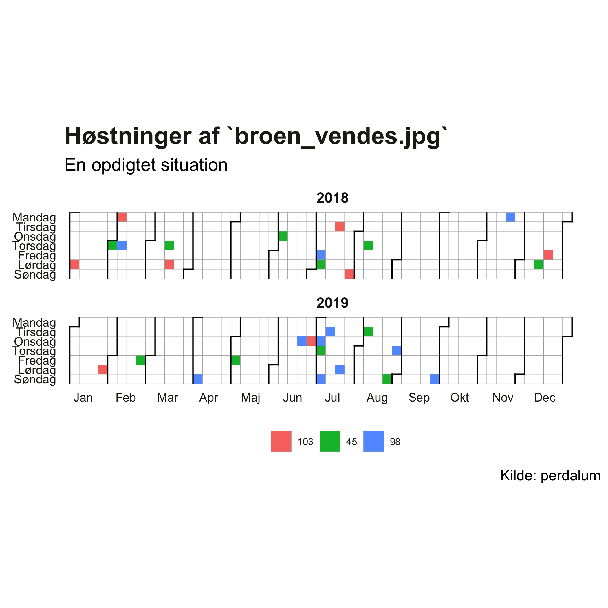
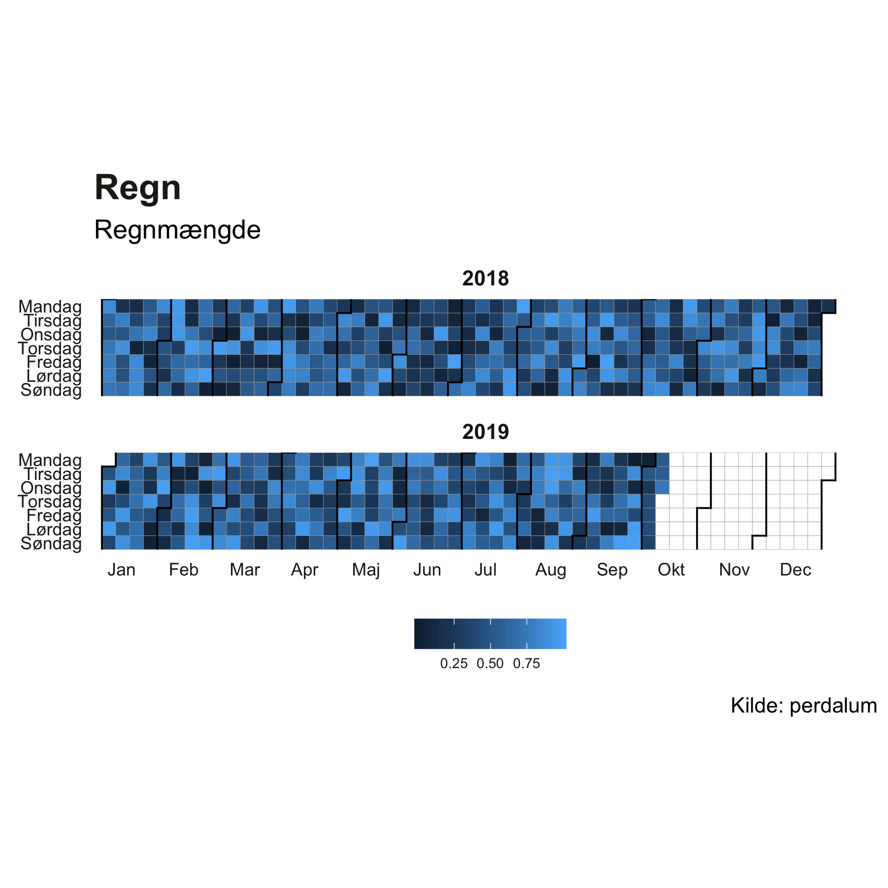

# r-files
Repository to hold R functions not yet ingested in a package

# Calendar heat maps

## calendar-heatmap-discrete

Creates a colour coded calendar visualising time series data where each date 
has a discrete value.

The implementation is inspired by [Calendar Heatmap](https://dominikkoch.github.io/Calendar-Heatmap/) by Dominik Koch.

### Example usage

```{r}
library(tidyverse)
library(lubridate)
```

Create some arbitrary example data

```{r}
dates <- sample(seq(ymd("2018-01-01"),today(), "day"), 30)
values <- sample(c("103", "98","45"), length(dates), replace = TRUE)
```

Create the plot

```{r}
source("https://raw.githubusercontent.com/perdalum/r-files/master/src/calendar-heatmap-discrete.R")

Sys.setlocale("LC_TIME", "da_DK.UTF-8")
calendar_heatmap_discrete_beta(dates, values) +
  labs(
    title = "Høstninger af `broen_vendes.jpg`",
    subtitle = "En opdigtet situation",
    caption = "Kilde: perdalum")
```


## calendar-heatmap-continuous

Creates a colour coded calendar visualising time series data where each date 
has a continuous value.

The implementation is inspired by [Calendar Heatmap](https://dominikkoch.github.io/Calendar-Heatmap/) by Dominik Koch.

### Example usage

Create some arbitrary continuous example data

```{r}
dates <- seq(from = ymd("2018-01-01"), to = today(), by = "day")
values <- runif(length(dates), 0, 1)
```

Create the plot

```{r}
source("https://raw.githubusercontent.com/perdalum/r-files/master/src/calendar-heatmap-continuous.R")
calendar_heatmap_continuous_beta(dates, values) +
  labs(
    title = "Regn", 
    subtitle = "Regnmængde",
    caption = "Kilde: perdalum")
```
